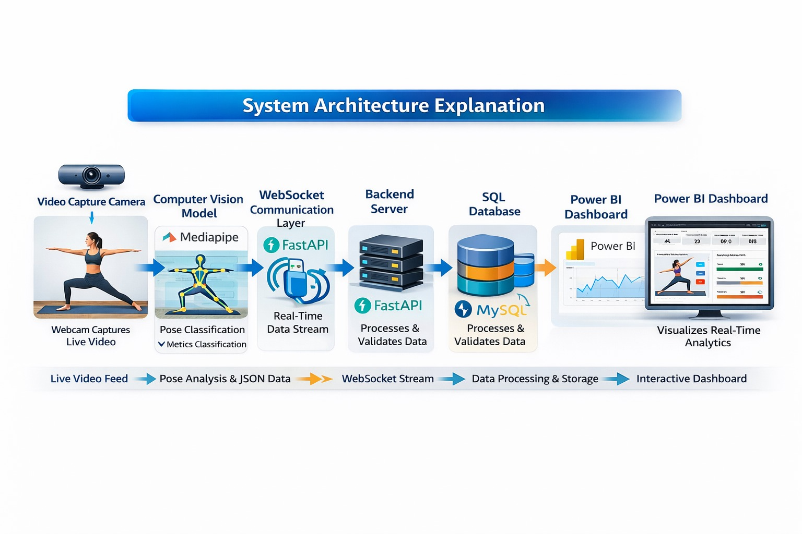

# 🧘 YogaVision Analytics

## 📌 Overview

YogaVision Analytics is a real-time yoga pose detection and monitoring system built using Computer Vision and WebSockets.  
The system detects yoga poses using MediaPipe, streams live pose data to a FastAPI backend, stores session data in a SQL database, and visualizes insights through a Power BI dashboard.

This project demonstrates real-time AI integration with backend systems and business intelligence tools.

## 🚀 Key Features

- 🎥 Real-time yoga pose detection using MediaPipe
- 📡 Live data streaming using WebSockets
- 🧠 Pose classification using joint angle calculations
- 🔥 Calories burned estimation
- 📊 Accuracy calculation using landmark visibility
- 🗄 Data storage in SQL database
- 📈 Real-time Power BI dashboard visualization

## 🏗 System Architecture

Camera  
⬇  
MediaPipe Pose Detection  
⬇  
Pose Classification (Angle-based logic)  
⬇  
WebSocket Client  
⬇  
FastAPI Backend  
⬇  
SQL Database  
⬇  
Power BI Dashboard  

## System Architecture

## 🛠 Technologies Used

- Python
- OpenCV
- MediaPipe
- NumPy
- FastAPI
- WebSockets
- MySQL / SQL
- Power BI

## 🗄 Database Schema

### Table: `yoga_sessions`

| Column      | Type      | Description |
|------------|----------|------------|
| session_id | INT (PK) | Unique session identifier |
| user_id    | INT      | User identifier |
| pose_name  | VARCHAR  | Detected pose name |
| duration   | FLOAT    | Duration in seconds |
| accuracy   | FLOAT    | Detection confidence (%) |
| calories   | FLOAT    | Estimated calories burned |
| timestamp  | DATETIME | Record creation time |

## 🔢 Pose Detection Logic

Pose classification is based on:

- Knee angles
- Elbow angles
- Body alignment angle
- Visibility confidence of landmarks

Supported poses:
- Plank
- Warrior II
- Downward Dog
- Tree
- Goddess

## 🔥 Calories Calculation

Calories burned is calculated using:

Calories = MET × Weight (kg) × Duration (hours)

Where:
- MET (Metabolic Equivalent) for yoga ≈ 3
- Weight is configurable

## 📊 Power BI Integration

Power BI connects to the SQL database and visualizes:

- Current Pose
- Total Calories Burned
- Average Accuracy
- Pose Distribution
- Time-based Trends

## 🎯 Project Objectives

- Demonstrate real-time AI system integration
- Implement WebSocket-based streaming architecture
- Store live ML outputs in relational databases
- Build interactive analytics dashboards

## 🧠 Future Improvements
1. Deep learning-based pose classification.
2. Multi-user authentication system.
3. Cloud deployment and scalability.
4. Real-time streaming dashboard integration.
5. Posture correction and feedback mechanism.
